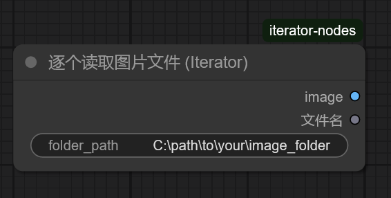

# ComfyUI-iterator-nodes
这是几个通过遍历特定文件夹来向后续节点逐个输送文件夹中图像、提示词（prompt）、视频文件（拆成图片组）、整个视频文件与逐个将视频文件先按特定间隔拆成关键帧图组，再通过API（openAI格式）上传给对应的大模型的ComfyUI节点。 

Here are several ComfyUI nodes that traverse specific folders to sequentially deliver images, prompts, video files (split into image sequences), entire video files, and video files first split into keyframe sequences at specific intervals to subsequent nodes, which then upload them to the corresponding large models via an API (OpenAI format).

注意1：这些逐个输送文件的节点均需要在ComfyUI开启 运行（更改时） 这一队列执行模式下才能全自动运行！若以普通运行模式运行的话就是点一次运行一次。

Note 1: These nodes that sequentially deliver files all require ComfyUI to be set to the **"Run (on change)"** queue execution mode for fully automatic operation! If running in the standard run mode, they will execute only once per manual run click.

注意2：逐个将视频文件进行特定间隔的拆帧，并将相关关键帧图像输出的节点（video_frames_by_interval_iterator node）后续需要搭配诸如spawner1145的OpenAIchat节点（https://github.com/spawner1145/comfyui-aichat ，在此感谢他制作的开源节点）等llm对话节点进行使用，且由于当前不同模型API提供商的“兼容”OpenAI格式的API对文件的上传与上传后的应答与上传文件大小限制等方面的要求均不相同，因此可能会出现各种各样的问题，强烈建议在上传文件前仔细查看API提供商的API文档并根据其格式对节点程序文件本身做对应的修改（如果你实在要用这个API提供商的API的话...）

Note 2: The node that splits video files into frames at specific intervals and outputs the relevant keyframe images (the `video_frames_by_interval_iterator` node) needs to be used in conjunction with LLM conversation nodes, such as the OpenAI chat node by spawner1145 (https://github.com/spawner1145/comfyui-aichat — many thanks to him for creating this open-source node). Furthermore, since the current "OpenAI-compatible" APIs from different model providers have varying requirements for file uploads, responses after upload, file size limits, and other aspects, a variety of issues may arise. It is strongly recommended to carefully review the API documentation of your provider and modify the node program files accordingly to match their specific format (if you are determined to use that particular provider's API...).

1、节点功能与视频抽帧打标组合示例工作流：（nodes function and Example Workflow for Video Frame Extraction and Tagging）

（1）逐个读取图片文件（image_file_iterator node）

这个节点用于逐个从特定文件夹中（文件夹绝对路径在file_path中输入或通过其他字符串节点导入到file_path）按命名顺序逐个读取并输出图像文件。在该文件夹内所有图片均被输出后节点将会主动报错停止队列来提示任务已经完成。

This node is used to sequentially read and output image files from a specific folder (the absolute folder path is input in `file_path` or imported via other string nodes into `file_path`) in alphabetical order. After all images in the folder have been output, the node will actively throw an error to stop the queue, indicating that the task has been completed.

（2）逐个读取txt文件（text_file_iterator node）

这个节点用于逐个从特定文件夹中（文件夹绝对路径在file_path中输入或通过其他字符串节点导入到file_path）按命名顺序逐个读取并输出txt文件的内容（一般与逐个读取图片文件节点（image_file_iterator node）配合使用以同时输出图像和与图像文件同名的txt文件内的prompt内容）。在该文件夹内所有txt文件的内容均被输出后节点将会主动报错停止队列来提示任务已经完成。

This node is used to sequentially read and output the contents of txt files from a specific folder (the absolute folder path is input in `file_path` or imported via other string nodes into `file_path`) in alphabetical order. It is typically used in conjunction with the image file iterator node to simultaneously output images and the prompt content from txt files sharing the same filename as the image files. After the contents of all txt files in the folder have been output, the node will actively throw an error to stop the queue, indicating that the task has been completed.

（3）比较文件名（filename_comparator node）

这个节点用于比较两个输出节点的输出文件名（filename）是否一致，并会在两个节点同时输出的文件名不一致时报错及时终止进程以避免造成更大的错误。此节点的filename输出可以接到诸如保存文件节点的文件名等地方。（你也不希望忙活了半天发现白忙活了对吧）

This node is used to compare whether the output filenames (`filename`) from two output nodes are consistent. It will throw an error and immediately terminate the process if the filenames output by the two nodes do not match, thereby preventing further errors. The `filename` output of this node can be connected to components such as the filename input of a save file node (You wouldn’t want to put in a lot of effort only to realize it was all in vain, right?).

（4）逐个读取视频文件（video_file_iterator node）

这个节点用于逐个从特定文件夹中（文件夹绝对路径在file_path中输入或通过其他字符串节点导入到file_path）按命名顺序逐个读取视频文件并将拆帧成一系列图片组。在该文件夹内所有视频文件均被输出后节点将会主动报错停止队列来提示任务已经完成。

This node is designed to sequentially read video files from a specified folder (the absolute path is provided via the `file_path` input, either directly or through other string nodes) in alphabetical order, and split each video into a series of image frames. After all video files in the folder have been processed and output, the node will actively throw an error to stop the queue, indicating that the task has been completed.

（5）逐个读取视频对象（video_object_iterator node）

这个节点用于逐个从特定文件夹中（文件夹绝对路径在file_path中输入或通过其他字符串节点导入到file_path）按命名顺序逐个读取并输出完整的视频文件（mp4格式）。在该文件夹内所有视频文件均被输出后节点将会主动报错停止队列来提示任务已经完成。

This node is used to sequentially read and output complete video files (in MP4 format) from a specified folder (the absolute folder path is input in `file_path` or imported via other string nodes into `file_path`) in alphabetical order. After all video files in the folder have been output, the node will actively throw an error to stop the queue, indicating that the task has been completed.

（6）迭代视频并按间隔提取多帧（video_frames_by_interval_iterator node）

这个节点用于逐个从特定文件夹中（文件夹绝对路径在file_path中输入或通过其他字符串节点导入到file_path）按命名顺序逐个读取并按照 frame_interval（采样间隔，例如，对于一个每秒帧数为16帧，总帧数为81帧（时长为5秒）的视频，当frame_interval=16时即为每秒抽取一帧，可视情况缩短抽帧间隔）抽取特定帧数的图像并分别将抽取到的图像按顺序输出到content_item_x中（content_item_x的数量可在节点Python文件中自行调节，此处默认最多输出十帧图片）。 而max_frames_to_extract可用于设置你最多想一次提取多少帧图片。例如，设置为 5。即使按间隔能提取出20帧，节点也只会在提取到第5帧后停止并输出。 在该文件夹内所有视频文件均被输出后节点将会主动报错停止队列来提示任务已经完成。（强烈建议搭配spawner1145的OpenAIchat节点（https://github.com/spawner1145/comfyui-aichat） 使用！因为其中的openAI内容块节点可有助于将拆分出来的图片整合起来并一齐输送给对应的llm对话节点）（由于当前不同模型API提供商的“兼容”OpenAI格式的API对文件的上传与上传后的应答等方面的要求均不相同，因此可能会出现各种各样的问题，强烈建议在上传文件前仔细查看API提供商的API文档并根据其格式对节点程序文件本身做对应的修改（如果你实在要用这个API提供商的API的话...））

This node is used to sequentially read video files from a specified folder (the absolute folder path is input in `file_path` or imported via other string nodes into `file_path`) in alphabetical order. It extracts frames at a defined `frame_interval` (sampling interval). For example, for a video with a frame rate of 16 FPS and a total of 81 frames (5 seconds in duration), setting `frame_interval = 16` would extract one frame per second. The interval can be adjusted as needed to extract more frames.  

The extracted images are sequentially output to `content_item_x` (the number of `content_item_x` outputs can be adjusted in the node's Python file; by default, a maximum of 10 frames are output). The `max_frames_to_extract` parameter can be used to set the maximum number of frames to extract in one operation. For example, if set to 5, the node will stop extracting and output after reaching 5 frames, even if the interval would allow extracting 20 frames.  

After all video files in the folder have been processed, the node will actively throw an error to stop the queue, indicating that the task has been completed.  

(It is highly recommended to use this node in conjunction with spawner1145's OpenAI chat node [https://github.com/spawner1145/comfyui-aichat], as its OpenAI content block node can help integrate the extracted images and send them together to the corresponding LLM conversation node.)  

(Since different model API providers have varying requirements for "OpenAI-compatible" APIs—such as file uploads, responses after upload, and file size limits—various issues may arise. It is strongly advised to carefully review the API documentation of your provider and modify the node program files accordingly to match their specific format, if you insist on using that provider's API...)

2、视频抽帧打标组合示例工作流（nodes function and Example Workflow for Video Frame Extraction and Tagging）

